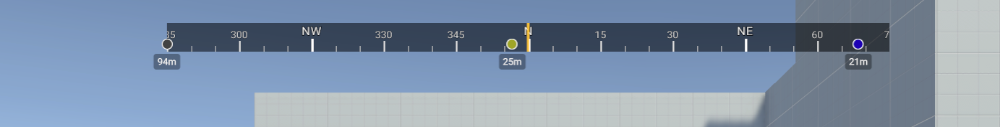
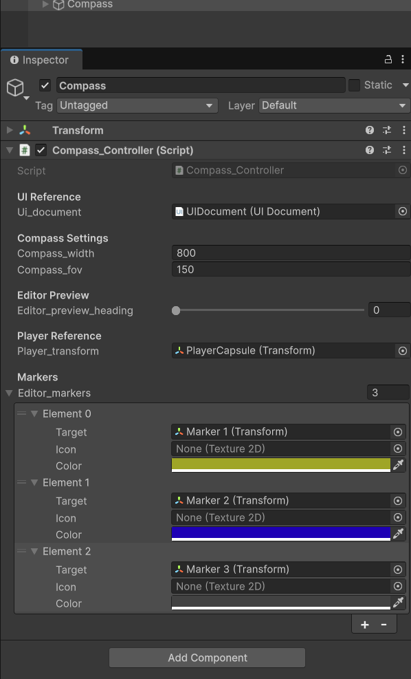

# Unity Horizontal Compass

A customizable horizontal compass UI for Unity games using UIToolkit. Displays player heading with cardinal directions and supports waypoint markers with distance tracking.



## Features

- Smooth horizontal compass bar with tick marks and cardinal directions
- Real-time heading tracking based on camera rotation
- Waypoint marker system with custom icons and colors
- Distance display for each marker
- Fully customizable via Inspector and USS stylesheets
- Editor preview mode for testing without entering Play mode
- Lightweight UI Toolkit based rendering

## Installation

1. Import the `Horizontal Compass` folder into your Unity project's Assets directory
2. Ensure your project supports UIToolkit (Unity 2021.2+)

## Quick Start

Download from the Releases page.

### 1. Add the Compass Controller

1. Add the **Compass_Controller** script to the same GameObject
2. Add the UI Document reference



### 3. Configure Settings

Adjust the compass settings in the Inspector to match your game's needs.

## Inspector Settings

### Compass_Controller

| Setting | Description |
|---------|-------------|
| **UI Document** | Reference to the UIDocument component (auto-detected if on same GameObject) |
| **Compass Width** | Width of the compass bar in pixels. Should match `--compass-width` in USS |
| **Compass FOV** | Field of view in degrees. Lower values zoom in, higher values show more of the world. Default: 150 |
| **Editor Preview Heading** | Simulates player heading in edit mode (0=North, 90=East, 180=South, 270=West) |
| **Player Transform** | Reference for distance calculations. Uses camera position if left empty |
| **Editor Markers** | List of waypoint markers to display |

### Marker Configuration

Each marker in the **Editor Markers** list has:

| Field | Description |
|-------|-------------|
| **Target** | The Transform to track in world space |
| **Icon** | Optional texture for the marker (uses default circle if empty) |
| **Color** | Tint color for the marker icon |

## USS Customization

The compass appearance can be fully customized by editing `UI/USS/Compass.uss`.

## Runtime API

### Adding Markers via Script

```csharp
// Get reference to the compass controller
Compass_Controller compass = GetComponent<Compass_Controller>();

// Add a marker with default settings
Compass_Marker marker = compass.add_marker(target_transform);

// Add a marker with custom icon and color
Compass_Marker custom_marker = compass.add_marker(
    target_transform,
    my_icon_texture,
    Color.red
);
```

### Removing Markers

```csharp
// Remove a specific marker
compass.remove_marker(marker);

// Remove all markers
compass.clear_markers();
```

## License

MIT License - see [LICENSE](LICENSE) for details. Use freely for personal and commercial projects.
