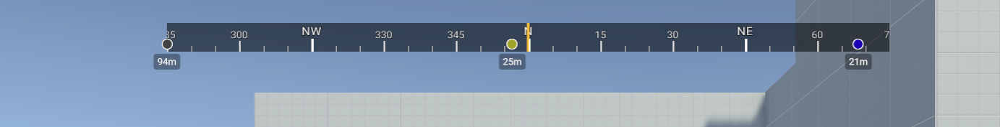
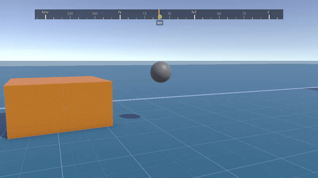
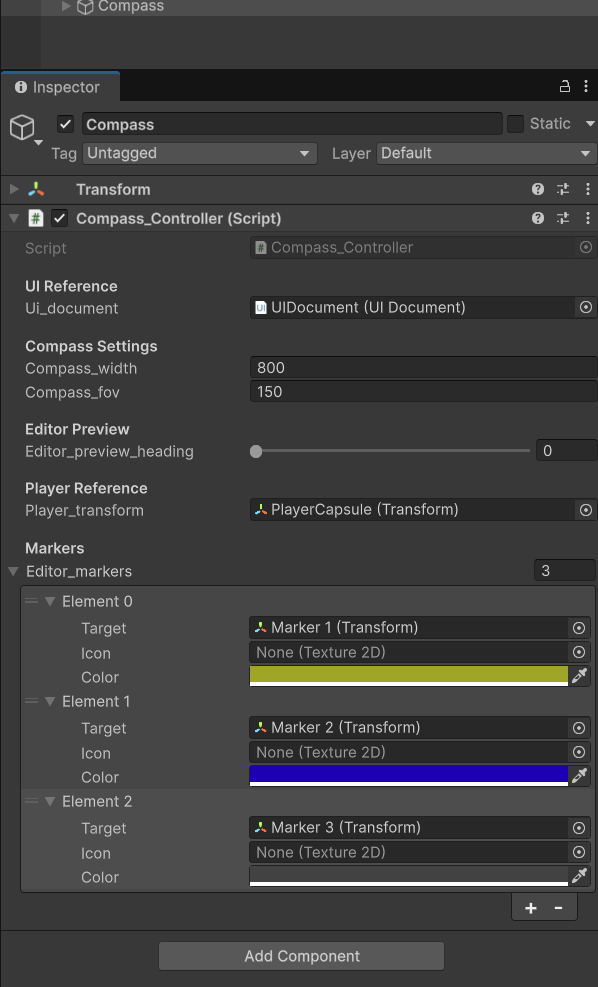

# Unity Horizontal Compass

A customizable horizontal compass UI for Unity games using UIToolkit. Displays player heading with cardinal directions and supports waypoint markers with distance tracking.





## Features

- Smooth horizontal compass bar with tick marks and cardinal directions.
- Real-time heading tracking based on camera rotation.
- Waypoint marker system with custom icons and colors.
- Distance display for each marker.
- Fully customizable via Inspector and USS stylesheets.
- Editor preview mode for testing without entering Play mode.
- Lightweight UI Toolkit based rendering.

## Requirements

- Requires **Unity 6.5 or newer**. The compass uses the Panel Renderer component, which was introduced in Unity 6.5.
- Built for the Universal Render Pipeline (URP).

Need an older Unity version? The last release built on the UI Document component (Unity 6.3 and 6.4) is available at the `unity-6.4` tag.

## Tested With

| Unity Version | Status |
|---------------|--------|
| 6000.5 (6.5)  | Working |

Other versions may work but haven't been verified. If you test on another version, a PR updating this table is welcome.

## Installation

1. Download from the Releases page and import into your project.
2. Ensure your project is on Unity 6.5 or newer.

## Quick Start

### 1. Add a Panel Renderer

Make sure you have a Panel Renderer component that the Compass can use.

### 2. Add Compass UI Toolkit Component.


### 3. Add the Compass Controller

1. Add the **Compass_Controller** script to a GameObject.
2. Add the Panel Renderer reference.



### 4. Configure Settings

Adjust the compass settings in the Inspector to match your game's needs.

## Inspector Settings

### Compass_Controller

| Setting | Description |
|---------|-------------|
| **Panel Renderer** | Reference to the PanelRenderer component (auto-detected if on same GameObject) |
| **Compass Width** | Width of the compass bar in pixels. Should match `--compass-width` in USS |
| **Compass FOV** | Field of view in degrees. Lower values zoom in, higher values show more of the world. Default: 150 |
| **Distance Unit** | Units for marker distance labels. `METERS` (default), `KILOMETERS` (meters, rolls over to km), or `IMPERIAL` (feet, rolls over to miles) |
| **Editor Preview Heading** | Simulates player heading in edit mode (0=North, 90=East, 180=South, 270=West) |
| **Player Transform** | Reference for distance calculations. Uses camera position if left empty |
| **Editor Markers** | List of waypoint markers to display |
| **Marker Range Threshold** | Distance in meters at which a marker raises `on_marker_within_range`. 0 disables the event (default) |

### Marker Configuration

Each marker in the **Editor Markers** list has:

| Field | Description |
|-------|-------------|
| **Target** | The Transform to track in world space |
| **Icon** | Optional texture for the marker (uses default circle if empty) |
| **Color** | Tint color for the marker icon |

## USS Customization

The compass appearance can be fully customized by editing `UI/USS/Compass.uss`.

## Runtime API

### Adding Markers via Script

```csharp
using net.pixeldepth.horizontal_compass;

// Get reference to the compass controller
Compass_Controller compass = GetComponent<Compass_Controller>();

// Add a marker with default settings
Compass_Marker marker = compass.add_marker(target_transform);

// Add a marker with custom icon and color
Compass_Marker custom_marker = compass.add_marker(
    target_transform,
    my_icon_texture,
    Color.red
);

// Add a marker that tracks a fixed world-space position (no Transform needed)
Compass_Marker world_marker = compass.add_marker(
    new Vector3(100f, 0f, 250f),
    my_icon_texture,
    Color.yellow
);
```

### Removing Markers

```csharp
// Remove a specific marker
compass.remove_marker(marker);

// Remove all markers
compass.clear_markers();
```

### Marker Events

Subscribe to react when markers enter or leave the compass, or come within range. Events fire in play mode only.

```csharp
compass.On_Marker_Entered_View += marker => Debug.Log("Marker in view");
compass.On_Marker_Exited_View += marker => Debug.Log("Marker left view");

// Requires Marker Range Threshold > 0 in the Inspector
compass.On_Marker_Within_Range += marker => Debug.Log("Marker within range");
```

For a ready-made example, attach `Compass_Event_Demo` (in `Horizontal Compass/Examples`) to a GameObject, assign your compass, and watch the Console in Play mode.

## License

MIT License - see [LICENSE](LICENSE) for details. Use freely for personal and commercial projects.
